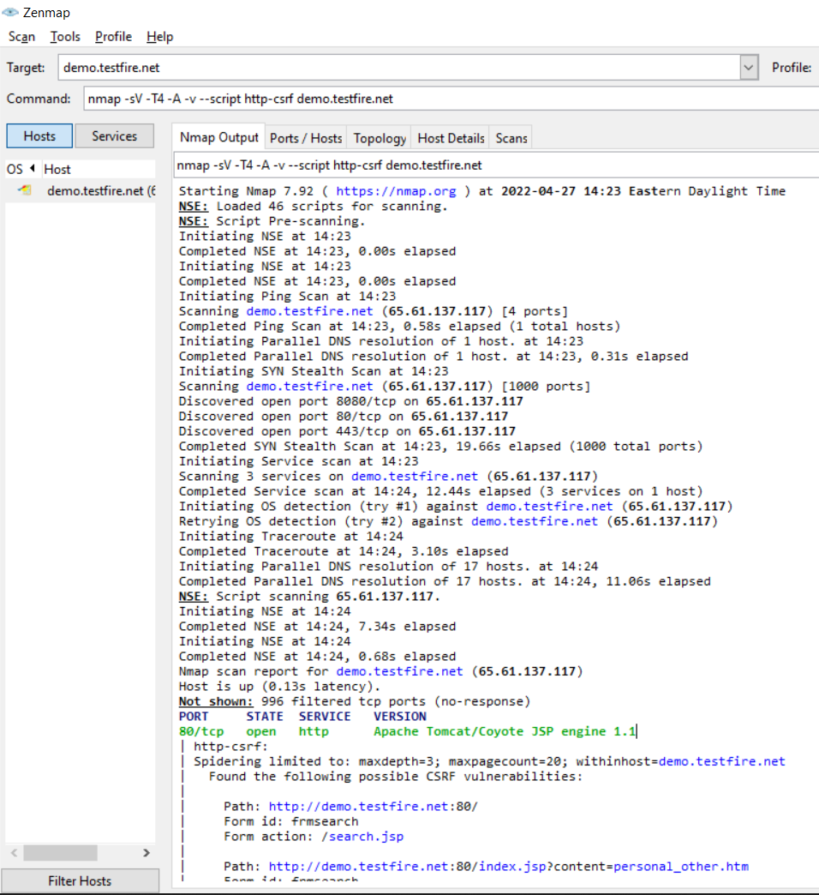

## Week 16 Homework Submission File: Penetration Testing 1

#### Step 1: Google Dorking

- Using Google, can you identify who the Chief Executive Officer of Altoro Mutual is: Karl Fitzgerald

via a simple google search like this one: **site:demo.testfire.net Chief Executive Officer**

- How can this information be helpful to an attacker: we know he is also the chairman, we can now search for:

**Email addresses, usernames, paswords, birthdates, etc... to gather informations (passive reconnaissance phase) via the OSINT framework: https://osintframework.com/
and hacker will prepare a whale phising attack to the CEO with the informations gathered.**

**A Protection against that is to teach the users not publish online any private informations: phone #, company email address, social media posts, linkedin / forums posts**

#### Step 2: DNS and Domain Discovery

Enter the IP address for `demo.testfire.net` into Domain Dossier and answer the following questions based on the results: 65.61.137.117

  1. Where is the company located: **US, Sunnyvale, 94085 California**

  2. What is the NetRange IP address: **65.61.137.64/26**

  3. What is the company they use to store their infrastructure: **Rackspace Cloud provider**

  4. What is the IP address of the DNS server: **asia3.akam.net [23.211.61.64], see below akamai.com dns servers"** :

testfire.net.	IN	A	65.61.137.117         asia3.akam.net. hostmaster.akamai.com.

**A Protection against that will be to host the DNS to a third party provider like cloudfare which protect more against privacy when outsiders are trying to gather information**

#### Step 3: Shodan

- What open ports and running services did Shodan find: http ports: **80 + 443 + 8080** on ip: **65.61.137.117**

**Web server running on Apache Tomcat/Coyote JSP engine1.1**

**A Protection against that will be to filter those ports and only allow traffic from trusted sources, users and or countries**

#### Step 4: Recon-ng

- Install the Recon module `xssed`. 

**marketplace install xssed**

- Set the source to `demo.testfire.net`. 

**module load xssed**
**options set SOURCE demo.testfire.net **

- Run the module. 

**run**

Is Altoro Mutual vulnerable to XSS: 

**yes as recon found 1 vulnerability on the search url which execute a script from a sec-r1z.com**

**A Protection against that will be to setup a SIEM, ELK to alerts and an IPS TO BLOCK this kind of scanning traffic when occured**

### Step 5: Zenmap

Your client has asked that you help identify any vulnerabilities with their file-sharing server. Using the Metasploitable machine to act as your client's server, complete the following:

- Command for Zenmap to run a service scan against the Metasploitable machine: 

**nmap -sV 192.168.0.10**
 
- Bonus command to output results into a new text file named `zenmapscan.txt`:

**nmap -sV -oN /tmp/zenmapscan.txt 192.168.0.10**

- Zenmap vulnerability script command: 

**nmap -sV --script http-apache-server-status demo.testfire.net**

**nmap -sV --script http-csrf demo.testfire.net**

- Once you have identified this vulnerability, answer the following questions for your client: 

**no findings but let's pretend XSS vulnerability**:

  1. What is the vulnerability: XSS = 
 
**Cross_Site Scripting**

  2. Why is it dangerous:

**Attacker can remotely execute scripts and accessing not allowed data like databases, usernames, password**

  3. What mitigation strategies can you recommendations for the client to protect their server:

**Output Encoding, Safe Links, HTML Sanitization and other controls will mitigate and usually a WAF like citrix have these controls to prevent.**
  
 *References: https://cheatsheetseries.owasp.org/cheatsheets/Cross_Site_Scripting_Prevention_Cheat_Sheet.html

 *References: https://docs.citrix.com/en-us/citrix-adc/current-release/application-firewall/security-checks-overview.html#:~:text=The%20Web%20App%20Firewall%20advanced,be%20detected%20by%20signatures%20alone
---
© 2020 Trilogy Education Services, a 2U, Inc. brand. All Rights Reserved.  
